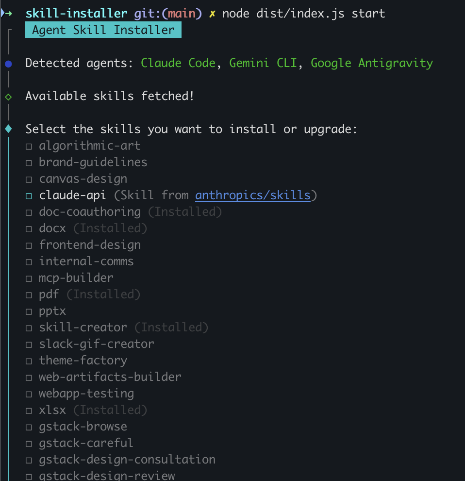

# Agent Skill Installer

This project is a CLI tool for the Agent platform. It allows users to browse and install skills on various AI agents using a beautiful interactive Terminal UI.



## Features
- **Multi-Agent Support**: Automatically detects installed AI agents (e.g., Google Antigravity, Gemini CLI, Claude Code).
- **Interactive TUI Picker**: Beautiful interface to select multiple skills to install or upgrade at once.
- **Zero-Limit Git Caching**: Bypasses GitHub API rate limits by intelligently cloning repository trees to a local cache (`~/.skill-installer/repos/`) to discover and sync skills instantly.
- **Rich Skill Previews**: Proactively parses YAML front-matter from local `SKILL.md` files to display interactive descriptions on hover inside the menu.
- **Smart Installation**: Clones new skills or intelligently upgrades (`git pull`) already installed ones straight into your local agent environment.
- **Installed Status**: Visually indicates which skills are already installed.

# Usage

`skill-installer start` # Start the skill installer

## Setup & Running Locally

1. Install dependencies:
   ```sh
   npm install
   ```
2. Build the project:
   ```sh
   npm run build
   ```
3. Run the installer:
   ```sh
   npm start
   # or
   node dist/index.js start
   ```

## Global Installation

If you want to install the tool globally so you can use `skill-installer` from anywhere on your machine without navigating to the project directory:

### For Development (Symlink)
To create a symlink that stays up-to-date with your local changes:
```sh
npm link
```

### Full Global Install
To install it statically as a global package:
```sh
npm install -g .
```

After doing either of these, you can simply run:
```sh
skill-installer start
```

### Self-Upgrading
If you installed the tool via symlink from a Git repository, you can easily self-update it by running:
```sh
skill-installer upgrade
```
This automatically fetches the latest code from the repository, installs dependencies, and rebuilds the CLI.

## Supported Target Agents

- [x] Gemini CLI (`~/.gemini/skills/`) - [Documentation](https://geminicli.com/docs/cli/skills/)
- [x] Google Antigravity (`~/.gemini/antigravity/skills/`)
- [x] Claude Code (`~/.claude/skills/`) - [Documentation](https://code.claude.com/docs/en/skills)
- [x] OpenAI Codex (`~/.agents/skills/`) - [Documentation](https://developers.openai.com/codex/skills)
- [x] OpenClaw (`~/.openclaw/skills/`) - [Documentation](https://docs.openclaw.ai/tools/skills)

## Skill Repositories Supported

- `anthropics/skills` (`skills/`)
- `garrytan/gstack` (`.agents/skills/`)
- `openai/skills` (`skills/.curated/`)
- Future custom skills support planned!